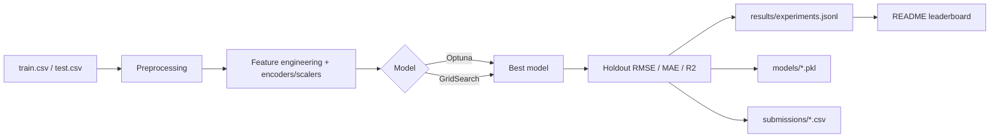

# House Prices: Advanced Regression with Hydra

Проект для задачи Kaggle [House Prices: Advanced Regression Techniques](https://www.kaggle.com/competitions/house-prices-advanced-regression-techniques) — предсказание цены продажи дома по табличным данным.

Цель проекта — построить воспроизводимый ML-пайплайн для решения задачи регрессии с оценкой качества по RMSE, поддержкой Hydra-конфигурации, автоматическим подбором гиперпараметров и логированием экспериментов.

[](https://www.python.org/)
[](https://hydra.cc/)
[](LICENSE)

---

## 📌 О проекте

В этом репозитории реализован пайплайн для прогнозирования `SalePrice` с использованием:

- классических моделей регрессии;
- градиентного бустинга (`XGBoost`, `LightGBM`, `CatBoost`);
- нейронной сети на PyTorch;
- ансамблей Voting и Stacking поверх сохранённых моделей.

Проект организован как конфигурируемый экспериментальный шаблон: данные, preprocessing, тюнинг, модели и логирование задаются через YAML в директории `config/`.

---

## 🏗 Архитектура пайплайна



Основной цикл эксперимента:
1. загрузка данных из `dataset/`;
2. разделение на train/validation;
3. preprocessing и кодирование признаков;
4. подбор гиперпараметров;
5. оценка на holdout-выборке;
6. сохранение модели и сабмита;
7. запись результатов в JSONL и обновление README.

---

## 📁 Структура репозитория

```text
House_Prices/
├── config/                  # Hydra-конфигурация
│   ├── config.yaml
│   ├── data/
│   ├── model/
│   ├── preprocessing/
│   ├── training/
│   ├── tuning/
│   └── logging/
├── dataset/                 # Kaggle train/test/sample submission
├── eda.ipynb                # EDA / исследовательский анализ
├── main.py                  # точка входа
├── preprocessing.py        # feature engineering и препроцессинг
├── tuning_params.py        # Optuna / GridSearch search spaces
├── ensembles.py            # Voting и Stacking поверх сохранённых моделей
├── nn_model.py             # PyTorch-нейросеть
├── log_utils.py            # логирование экспериментов и W&B
├── readme_leaderboard.py   # обновление лидерборда в README
├── utils.py                # вспомогательные функции
├── requirements.txt
└── README.md
```

---

## 🚀 Быстрый старт

### Требования

- Python 3.10+
- pip / conda / venv
- около 2–3 ГБ свободного места для зависимостей и моделей

### Установка

```bash
git clone <repo-url>
cd House_Prices

python -m venv .venv
source .venv/bin/activate        # Windows: .venv\Scripts\activate

pip install -r requirements.txt
```

### Запуск эксперимента

```bash
python main.py
```

Во время запуска:
- строятся модели из `config/model/`;
- подбираются гиперпараметры;
- выполняется holdout-оценка;
- создаются модели в `models/`, сабмиты в `submissions/` и результаты в `results/experiments.jsonl`.

### Примеры переопределения параметров

```bash
# отключить тюнинг и использовать дефолтные параметры
python main.py tuning.enabled=false

# переключиться на GridSearch вместо Optuna
python main.py tuning.use_grid_search=true tuning.use_optuna=false

# изменить число Optuna-попыток и метрику
python main.py tuning.n_trials=100 tuning.metric=rmse
```

---

## ⚙️ Конфигурация (Hydra)

Основной конфиг находится в `config/config.yaml`. Он собирает все группы настроек через `defaults`:

```yaml
defaults:
  - data: default
  - training: default
  - preprocessing: default
  - tuning: default
  - logging: default
  - model@model.linear_model: linear_model
  - model@model.knn: knn
  - model@model.dt: dt
  - model@model.rf: rf
  - model@model.xgboost: xgboost
  - model@model.lightgbm: lightgbm
  - model@model.catboost: catboost
  - model@model.nn_model: nn_model
  - model@model.ensemble: ensemble
  - _self_

experiment_name: House_Pricing
target_column: SalePrice
seed: 42
```

---

## 🤖 Модели

В проекте доступны следующие подходы:

- `LinearRegression` / `ElasticNet`
- `KNeighborsRegressor`
- `DecisionTreeRegressor`
- `RandomForestRegressor`
- `XGBRegressor`
- `LGBMRegressor`
- `CatBoostRegressor`
- `NN_Model` (PyTorch)
- `Ensemble` (Voting / Stacking)

Оценка качества в регрессии идёт по RMSE, MAE и R2, а результаты сохраняются в `results/experiments.jsonl`.

---

## 🧹 Предобработка

В проекте используется гибридный препроцессинг:

- обработка пропусков;
- кодирование категориальных признаков через разные encoder'ы;
- масштабирование числовых признаков;
- feature engineering на основе исходных признаков датасета.

Подход легко настраивается через конфиги в `config/preprocessing/`.

---

## 📊 Лидерборд

По завершении каждого запуска таблица лидеров обновляется автоматически и вставляется в этот README между тегами:

<!-- leaderboard_start -->
| model                       |   metric |   tuning_time_sec |   latency_ms_per_sample |
|:----------------------------|---------:|------------------:|------------------------:|
| CatBoostRegressor           | 0.130781 |          3890.93  |                1.4845   |
| PreTrainedStackingRegressor | 0.132647 |             2.01  |                1.77592  |
| ElasticNet                  | 0.140876 |            28.47  |                0.2986   |
| PreTrainedVotingRegressor   | 0.149473 |             0     |                1.4501   |
| NN_Model                    | 0.172225 |            82.205 |                0.124788 |
| KNeighborsRegressor         | 0.178462 |            48.86  |                0.5892   |
| XGBRegressor                | 0.182606 |           174.58  |                0.4476   |
| LGBMRegressor               | 0.18497  |           307.64  |                0.5206   |
| RandomForestRegressor       | 0.185162 |          1715.19  |                1.5259   |
| DecisionTreeRegressor       | 0.231605 |            35.44  |                0.2715   |
<!-- leaderboard_end -->

---

## 📝 Логирование

Эксперименты логируются в JSONL-файл `results/experiments.jsonl`, а при необходимости можно включить и Weights & Biases.

---

## 🛠️ Технологии

- `pandas`, `numpy`
- `scikit-learn`
- `xgboost`, `lightgbm`, `catboost`
- `torch`, `torchmetrics`
- `optuna`
- `hydra-core`, `omegaconf`
- `joblib`, `matplotlib`, `seaborn`

---

## 📄 Лицензия

Проект распространяется под лицензией MIT.

